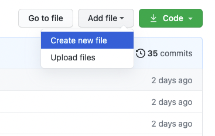
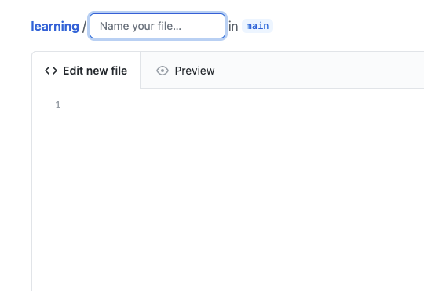

# GitHub

- [GitHub Actions](./actions)
- [Pull Request](./pull_request)

## GitHub.com 上でのファイル追加

1. `Add file`→`Create new file`を選択

2. コードを書ける画面が表示されるので、`Name your file...`にファイル名を入力して内容を書き込んだら、一番下にある`Commit changes`でコミットする

＊ファイル名を入力する際、スラッシュ`/`で区切ると下の階層のディレクトリに移動できる

